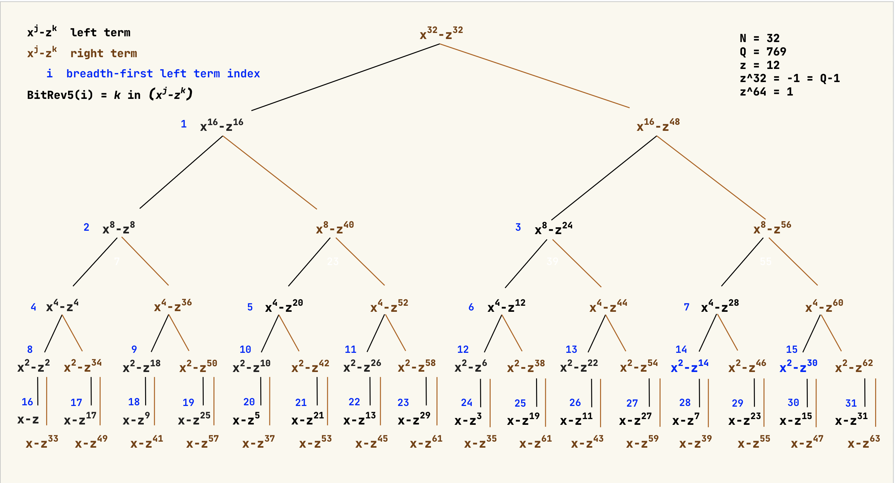

<head>
    <link rel="stylesheet" href="https://cdn.jsdelivr.net/npm/katex@0.16.27/dist/katex.min.css" integrity="sha384-Pu5+C18nP5dwykLJOhd2U4Xen7rjScHN/qusop27hdd2drI+lL5KvX7YntvT8yew" crossorigin="anonymous">
    <!-- The loading of KaTeX is deferred to speed up page rendering -->
    <script defer src="https://cdn.jsdelivr.net/npm/katex@0.16.27/dist/katex.min.js" integrity="sha384-2B8pfmZZ6JlVoScJm/5hQfNS2TI/6hPqDZInzzPc8oHpN5SgeNOf4LzREO6p5YtZ" crossorigin="anonymous"></script>
    <!-- To automatically render math in text elements, include the auto-render extension: -->
    <script defer src="https://cdn.jsdelivr.net/npm/katex@0.16.27/dist/contrib/auto-render.min.js" integrity="sha384-hCXGrW6PitJEwbkoStFjeJxv+fSOOQKOPbJxSfM6G5sWZjAyWhXiTIIAmQqnlLlh" crossorigin="anonymous"
        onload="renderMathInElement(document.body);"></script>
    <link rel="stylesheet" type="text/css" href="https://tikzjax.com/v1/fonts.css">
    <script src="https://tikzjax.com/v1/tikzjax.js"></script>
</head>

## Tiny DSA - Factoring the Reduction Polynomial $x^{32} + 1$
In this section we derive the irreducible factors of the reduction polynomial $x^{32} + 1$.

The first interesting fact to notice is the following equivalence under the polynomial ring $R_q$
$$
\begin{array}{ll}
    x^{32} + 1 & = x^{32} + \ {\boxed{\color{magenta}\zeta^{0}}} \\
               & = x^{32} \ {\boxed{\color{magenta} - \zeta^{32 + 0}}} \\
               & = x^{32} - \zeta^{32}
\end{array}
$$

In general, whenever we see a term of the form
$$
    x^{m} + \zeta^n \in R_q  \qquad m \ge 1, n \ge 0
$$
we can replace it with
$$
    x^{m} - \zeta^{32 + n}
$$

### Level 1 - Factors of $x^{32} - \zeta^{32}$

```{=latex}
\begin{figure}
\centering
\begin{tikzpicture}[
        scale=1.25,
        transform shape,
        level distance=2cm,
        sibling distance=4cm,
        every label/.style={text=blue, font=\scriptsize}
    ]
    % root of the expression tree
    \node (root) {$x^{32} - \zeta^{32}$}
        % left
        child {
            node[label={[]below:{1}}] (left) {$x^{16} - \zeta^{16}$}
            edge from parent node[left, xshift=-2mm, red] {0}
        }
        % right
        child {
            node (right) {$x^{16} - \zeta^{48}$}
            edge from parent node[right, xshift=2mm, red] {1}
        };
\end{tikzpicture}
\end{figure}
```

<script type="text/tikz">
    \begin{tikzpicture}[
        scale=1.5,
        transform shape,
        level distance=2cm,
        sibling distance=4cm,
        every label/.style={text=blue, font=\scriptsize}
    ]
    % root of the expression tree
    \node (root) {$x^{32} - \zeta^{32}$}
        % left
        child {
            node[label={[]below:{1}}] (left) {$x^{16} - \zeta^{16}$}
            edge from parent node[left, xshift=-2mm, red] {0}
        }
        % right
        child {
            node (right) {$x^{16} - \zeta^{48}$}
            edge from parent node[right, xshift=2mm, red] {1}
        };
\end{tikzpicture}
</script>


### Level 2 - Factors of $x^{16} - \zeta^{16}$ and $x^{16} - \zeta^{48}$
```{=latex}
\begin{figure}
\centering
\begin{tikzpicture}[
        scale=1.25,
        transform shape,
        level distance=2cm,
        level 1/.style={sibling distance=8cm},
        level 2/.style={sibling distance=4cm},
        every label/.style={text=blue, font=\scriptsize}
    ]
    % root of the expression tree
    \node (root) {$x^{32} - \zeta^{32}$}
        % left - 0 - x^16-1
        child {
            node[label={[]below:{1}}] (left) {$x^{16} - \zeta^{16}$}
            % left - 00
            child {
                node[label={[]below:{2}}] {$x^{8} - \zeta^{8}$}
                edge from parent node[left, xshift=-2mm, red] {00}
            }
            % right - 01
            child {
                node (right01) {$x^{8} - \zeta^{40}$}
                edge from parent node[right, xshift=2mm, red] {01}
            }
            edge from parent node[left, xshift=-3mm, red] {0}
        }
        % right -1
        child {
            node (right1) {$x^{16} - \zeta^{48}$}
            % left - 10
            child {
                node[label={[]below:{3}}] (left10) {$x^{8} - \zeta^{24}$}
                edge from parent node[left, xshift=-2mm, red] {10}
            }
            % right - 11
            child {
                % Renamed from (right) to (right11)
                node (right11) {$x^{8} - \zeta^{56}$}
                edge from parent node[right, xshift=2mm, red] {11}
            }
            edge from parent node[right, xshift=3mm, red] {1}
        };
\end{tikzpicture}
\end{figure}
```

<script type="text/tikz">
\begin{tikzpicture}[
        scale=1.5,
        transform shape,
        level distance=2cm,
        level 1/.style={sibling distance=7cm},
        level 2/.style={sibling distance=4cm},
        level 3/.style={sibling distance=2cm},
        every label/.style={text=blue, font=\scriptsize}
    ]
    % root of the expression tree
    \node (root) {$x^{32} - \zeta^{32}$}
        % left - 0 - x^16-1
        child {
            node[label={[]below:{1}}] (left) {$x^{16} - \zeta^{16}$}
            % left - 00
            child {
                node[label={[]below:{2}}] {$x^{8} - \zeta^{8}$}
                child {
                    % left - x^4 - \zeta^4 - 000
                    node[label={[text=blue]below:{4}}] {$x^{4} - \zeta^{4}$}
                    edge from parent node[left, xshift=-1mm, red] {000}
                }
                child {
                    % left - x^4 - \zeta^34 - 001
                    node (right001) {$x^{8} - \zeta^{36}$}
                    edge from parent node[right, xshift=1mm, red] {001}
                }
                edge from parent node[left, xshift=-2mm, red] {00}
            }
            % right - 01
            child {
                node (right01) {$x^{8} - \zeta^{40}$}
                child {
                    % left - x^4 - \zeta^4 - 010
                    node[label={[]below:{5}}] {$x^{4} - \zeta^{20}$}
                    edge from parent node[left, xshift=-1mm, red] {010}
                }
                child {
                    % left - x^4 - \zeta^34 - 011
                    node (right011) {$x^{8} - \zeta^{52}$}
                    edge from parent node[right, xshift=1mm, red] {011}
                }
                edge from parent node[right, xshift=2mm, red] {01}
            }
            edge from parent node[left, xshift=-3mm, red] {0}
        }
        % right -1
        child {
            node (right1) {$x^{16} - \zeta^{48}$}
            % left - 10
            child {
                node[label={[]below:{3}}] (left10) {$x^{8} - \zeta^{24}$}
                edge from parent node[left, xshift=-2mm, red] {10}
            }
            % right - 11
            child {
                % Renamed from (right) to (right11)
                node (right11) {$x^{8} - \zeta^{56}$}
                edge from parent node[right, xshift=2mm, red] {11}
            }
            edge from parent node[right, xshift=3mm, red] {1}
        };
\end{tikzpicture}
</script>

### Level 3 - Factors of $x^{8} - \zeta^8, \ x^{8} - \zeta^{40}, \ x^{8} - \zeta^{24}$ and $x^{8} - \zeta^{56}$
```{=latex}
\begin{figure}
\centering
\begin{tikzpicture}[
        scale=1.15,
        transform shape,
        level distance=2cm,
        level 1/.style={sibling distance=7.5cm},
        level 2/.style={sibling distance=3.75cm},
        level 3/.style={sibling distance=1.8cm},
        every label/.style={text=blue, font=\scriptsize}
    ]
    % root of the expression tree
    \node (root) {$x^{32} - \zeta^{32}$}
        % left - 0 - x^16-1
        child {
            node[label={below:{1}}] (left) {$x^{16} - \zeta^{16}$}
            % left - 00
            child {
                node[label={below:{2}}] {$x^{8} - \zeta^{8}$}
                child {
                    % left - x^4 - \zeta^4 - 000
                    node[label={below:{4}}] {$x^{4} - \zeta^{4}$}
                    edge from parent node[left, xshift=-1mm, red] {000}
                }
                child {
                    % left - x^4 - \zeta^34 - 001
                    node (right001) {$x^{8} - \zeta^{36}$}
                    edge from parent node[right, xshift=1mm, red] {001}
                }
                edge from parent node[left, xshift=-2mm, red] {00}
            }
            % right - 01
            child {
                node (right01) {$x^{8} - \zeta^{40}$}
                child {
                    % left - x^4 - \zeta^4 - 010
                    node[label={[]below:{5}}] {$x^{4} - \zeta^{20}$}
                    edge from parent node[left, xshift=-1mm, red] {010}
                }
                child {
                    % left - x^4 - \zeta^34 - 011
                    node (right011) {$x^{8} - \zeta^{52}$}
                    edge from parent node[right, xshift=1mm, red] {011}
                }
                edge from parent node[right, xshift=2mm, red] {01}
            }
            edge from parent node[left, xshift=-3mm, red] {0}
        }
        % right -1
        child {
            node (right1) {$x^{16} - \zeta^{48}$}
            % left - 10
            child {
                node[label={[]below:{3}}] (left10) {$x^{8} - \zeta^{24}$}
                child {
                    % left - x^4 - \zeta^12 - 100
                    node[label={[]below:{6}}] {$x^{4} - \zeta^{12}$}
                    edge from parent node[left, xshift=-1mm, red] {100}
                }
                child {
                    % left - x^4 - \zeta^34 - 101
                    node (right101) {$x^{8} - \zeta^{34}$}
                    edge from parent node[right, xshift=1mm, red] {101}
                }
                edge from parent node[left, xshift=-2mm, red] {10}
            }
            % right - 11
            child {
                % Renamed from (right) to (right11)
                node (right11) {$x^{8} - \zeta^{56}$}
                child {
                    % left - x^4 - \zeta^28 - 110
                    node[label={[]below:{7}}] {$x^{4} - \zeta^{28}$}
                    edge from parent node[left, xshift=-1mm, red] {110}
                }
                child {
                    % left - x^4 - \zeta^60 - 111
                    node (right111) {$x^{8} - \zeta^{60}$}
                    edge from parent node[right, xshift=1mm, red] {111}
                }
                edge from parent node[right, xshift=2mm, red] {11}
            }
            edge from parent node[right, xshift=3mm, red] {1}
        };
\end{tikzpicture}
\end{figure}
```

### Level 4

```{=latex}
\newpage
\begin{landscape}
\thispagestyle{empty}
\vspace*{3mm}\text{Number Theoretic Transforms in ML DSA} \hfill \text{Jan-2026}\vspace{-4mm}\\
\noindent\rule{\linewidth}{0.4pt}
\begin{figure}
\centering
\begin{tikzpicture}[
        scale=1.15,
        transform shape,
        level distance=2cm,
        level 1/.style={sibling distance=7.5cm},
        level 2/.style={sibling distance=3.75cm},
        level 3/.style={sibling distance=1.8cm},
        every label/.style={text=blue, font=\scriptsize}
    ]
    % root of the expression tree
    \node (root) {$x^{32} - \zeta^{32}$}
        % left - 0 - x^16-1
        child {
            node[label={below:{1}}] (left) {$x^{16} - \zeta^{16}$}
            % left - 00
            child {
                node[label={below:{2}}] {$x^{8} - \zeta^{8}$}
                child {
                    % left - x^4 - \zeta^4 - 000
                    node[label={below:{4}}] {$x^{4} - \zeta^{4}$}
                    edge from parent node[left, xshift=-1mm, red] {000}
                }
                child {
                    % left - x^4 - \zeta^34 - 001
                    node (right001) {$x^{8} - \zeta^{36}$}
                    edge from parent node[right, xshift=1mm, red] {001}
                }
                edge from parent node[left, xshift=-2mm, red] {00}
            }
            % right - 01
            child {
                node (right01) {$x^{8} - \zeta^{40}$}
                child {
                    % left - x^4 - \zeta^4 - 010
                    node[label={[]below:{5}}] {$x^{4} - \zeta^{20}$}
                    edge from parent node[left, xshift=-1mm, red] {010}
                }
                child {
                    % left - x^4 - \zeta^34 - 011
                    node (right011) {$x^{8} - \zeta^{52}$}
                    edge from parent node[right, xshift=1mm, red] {011}
                }
                edge from parent node[right, xshift=2mm, red] {01}
            }
            edge from parent node[left, xshift=-3mm, red] {0}
        }
        % right -1
        child {
            node (right1) {$x^{16} - \zeta^{48}$}
            % left - 10
            child {
                node[label={[]below:{3}}] (left10) {$x^{8} - \zeta^{24}$}
                child {
                    % left - x^4 - \zeta^12 - 100
                    node[label={[]below:{6}}] {$x^{4} - \zeta^{12}$}
                    edge from parent node[left, xshift=-1mm, red] {100}
                }
                child {
                    % left - x^4 - \zeta^34 - 101
                    node (right101) {$x^{8} - \zeta^{34}$}
                    edge from parent node[right, xshift=1mm, red] {101}
                }
                edge from parent node[left, xshift=-2mm, red] {10}
            }
            % right - 11
            child {
                % Renamed from (right) to (right11)
                node (right11) {$x^{8} - \zeta^{56}$}
                child {
                    % left - x^4 - \zeta^28 - 110
                    node[label={[]below:{7}}] {$x^{4} - \zeta^{28}$}
                    edge from parent node[left, xshift=-1mm, red] {110}
                }
                child {
                    % left - x^4 - \zeta^60 - 111
                    node (right111) {$x^{8} - \zeta^{60}$}
                    edge from parent node[right, xshift=1mm, red] {111}
                }
                edge from parent node[right, xshift=2mm, red] {11}
            }
            edge from parent node[right, xshift=3mm, red] {1}
        };
\end{tikzpicture}
\end{figure}
\vfill
\noindent\rule{\linewidth}{0.4pt}\\
\raggedleft\thepage\vspace{1cm}
\end{landscape}
```

<script type="text/tikz">
</script>

# Tiny DSA and Number Theoretic Transforms
Number Theoretic Transforms (NTTs) are integral to the ML DSA specification. The NTT representation enables efficient polynomial addition, subtraction, and multiplication. In this section, we develop all the key ideas behind NTTs in a step-by-step fashion. To illustrate these concepts, we define *Tiny DSA*, a simplified system that follows the ML-DSA structure. This development draws heavily from Prof. Alfred Menezes' excellent notes and videos.

Tiny DSA uses the following constants, symbols, and mathematical expressions:

$$
\begin{array}{rll}
&q & \text{The prime number} \ q = 2^{10} - 2^8 + 1 = 769.\\\\
&\mathbb{N} & \text{The set of natural numbers}.\\\\
&\mathbb{Z} & \text{The ring of integers}.\\
&\mathbb{Z}_q & \text{The ring of integers modulo} \ q \ \text{whose set of elements is} \ \{0, 1, \ldots, q-1\}.\\
&\mathbb{Z}^n_q & \text{The set of $n$-tuples over $Z_q$}.\\\\
&T_q & \text{The ring} \ \Pi_{j=0}^{32}\,\mathbb{Z}_q. \\\\
R & Z[X]/(X^{32}+1) &  \text{The ring of single-variable polynomials over} \ \mathbb{Z} \ \text{modulo} \ X^{32}+1. \\
    && \text{The coefficients of polynomials in} \ R \ \text{belong to the ring} \ \mathbb{Z}.\\
    && \text{The highest-degree term is at most} \ x^{31}.\\\\
R_q & Z_q[X]/(X^{32}+1) &  \text{The ring of single-variable polynomials over} \ \mathbb{Z}_q \ \text{modulo} \ X^{32}+1. \\
    && \text{The coefficients of polynomials in} \ R_q \ \text{belong to the ring} \ \mathbb{Z}_q.\\
    && \text{The highest-degree term is at most} \ x^{31}. \\\\
    & (X^{32}+1) & \text{The} \ reduction \ polynomial. \\\\
 \omega, \ z, \ zeta \ \ & \zeta & \text{The} \ \mathbf{primitive \ 64^{th} \ root} \ \text{of unity in} \ \mathbb{Z}_q. \\
    && \zeta^{64} \equiv 1 \ \text{mod} \ q.\\
    && \zeta^k \not\equiv 1 \ \text{mod} \ q \ for \ all \ k < 64.\\
    && \zeta = 12 \ \text{in Tiny DSA}.\\\\
& \lbrack a, b \rbrack & \text{For two integers} \ a \le b, \ [a, b] \ \text{denotes the set of integers} \ \{a, a+1, \ldots, b \}.\\\\
\end{array}
$$

## Examples of Polynomial Rings
Polynomial ring $Z[x]$ is the set of all polynomials with coefficients in $Z$ = {-$\infty$, $\ldots$, -1, 0, 1, $\ldots$, $\infty$}.

Polynomial ring $Z_q[x]$ is the set of all polynomials with coefficients in $Z_q$ = {0, 1, $\ldots$, $q-1$}.


*Example 1* - Polynomial $a(x) \in \mathbb{Z}[x]$.
$$
    a(x) = -12 + 20367x - 2081x^{56} + 10x^{1023}
$$

$\colorbox{gray}{}$


*Example 2* - Polynomial $b(x) \in \mathbb{Z}_q[x]$.

The coefficients of $a(x)$ from *Example 1* are mapped to $\mathbb{Z}_q$ in polynomial $b(x)$ below.

Keep in mind, Tiny DSA defines $q = 769$.

$$
  \begin{array}{lll}
    a(x) & = & -12 + 20367x - 2081x^{56} + 10x^{1023}\\
    b(x) & = & (-12 \ \text{mod} \ 769) \\
        &   & \, + \, (20367 \ \text{mod} \ 769) x \\
        &   & \, + \, (-(2081 \ \text{mod} \ 769) \ \text{mod} \ 769)x^{56} \\
        &   & \, + \, 10x^{1023} \\
        & = & \, (769-12) + 373x + (769-543)x^{56} + 10x^{1023}\\
        & = & \, 757 + 373x + 226x^{56} + 10x^{1023}\\
\end{array}
$$

$\colorbox{gray}{}$


## Examples of Polynomials in Tiny DSA
If polynomial $a(x) \in R[x]$, its coefficients are in the ring $\mathbb{Z}$ and its highest-degree term is at most $x^{31}$.

If polynomial $a(x) \in R_q[x]$, its coefficients are in the ring $\mathbb{Z}_q$ and its highest-degree term is at most $x^{31}$.

*Example 1* - Polynomial $a(x) \in R_q[x]$.

In the polynomial $a(x) = 7 + 23x^{31}$, first term is the lowest-degree term, and the second, the highest-degree term.

$\colorbox{gray}{}$

*Example 2* - Polynomial $a(x) \in R_q$.

Consider the polynomial $a(x) = 63 + 159x + 48x^2 + 746x^{28} + x^{30}$. Its coefficients are in $\mathbb{Z_q}$, and the highest-degree term is $x^{30}$. Therefore, $a(x) \in R_q$.

$\colorbox{gray}{}$

*Example 3* - Polynomial $a(x) \in R \ \text{and} \ a(x) \not\in R_q$.

Consider the polynomial $a(x) = 2163 - 169x + 1048x^2 - 1746x^{28} + 2x^{30} \in R$.
Note $a(x) \not\in R_q$ because ***not all coefficients*** are in $Z_q$. The coefficients of all terms except the last one are in $\mathbb{Z}$.

$\colorbox{gray}{}$

*Example 4* - Transform $a(x) \in R$ to $b(x) \in R_q$.

For a number $z \in \ \mathbb{Z}$, $z \ \text{mod} \ q$ maps it to $\mathbb{Z}_q$. Therefore, given a polynomial $a(x) \in R$, transforming its coefficients *mod 769* transforms the polynomial to $R_q$.

$$
\begin{array}{llll}
a(x) & = & 2163 - 169x + 1048x^2 - 1746x^{28} + 2x^{30} & \in R\\
b(x) & = & (2163 \ mod \ 769) \\
    &   & \, + \, (-169 \ mod \ 769) x \\
    &   & \, + \, (1048 \ mod \ 769)x^2 \\
    &   & \, + \, ((-(1746 \ mod \ 769) \ mod \ 769))x^{28} \\
    &   & \, + \, (2 \ mod \ 769) x^{30} \\
   & = & 625 + 600x + 279x^2 +  561x^{28} + 2x^{30} & \in R_q\\
\end{array}
$$

$\colorbox{gray}{}$


<a id="primitives-roots-of-unity"></a>

## Primitive Roots of Unity {#primitives-roots-of-unity}
Let $n = 2^k$, and let $q$ be a prime such that $q-1$ is divisible by $2n$.

$$
\begin{array}{rlll}
n & = \ 32 & = 2^5\\
2n & = \ 64 & = 2^6 \\
q & = \ 2^{10} - 2^{8} + 1 & = 769\\
q-1 & = \ 2^8(2^2 - 1) & = 768\\
(q-1)/2n & = \ 2^8(2^2 - 1)/2^6 & = 12\\
\end{array}
$$

Let $\zeta \in \mathbb{Z}_q$ be an element of order $2n$. The order of of $\zeta$ is the smallest positive integer $t$ such that $\zeta^t = 1$.

In Tiny DSA, $\zeta = 12$, $\zeta^{2n} \equiv 1  \ \text{mod} \ q$, and $\zeta^n \equiv -1 \ \text{mod} \ q$.

```{.number-lines .python}
# python3
n = 32
q = 769
z = 12
assert pow(z, 2*n, q) == 1
assert pow(z, n, q) == q-1
# following two expressions evaluate to the same value.
assert pow(-1, 1, q) == q-1
assert -1 % q == q-1
# this follows directly from the above expressions.
assert -1 % q == pow(-1, 1, q)
# for all k < 64, z^k != 1 mod q.
# in other words, there is no k in [1, 63] such that z^k = 1 mod q
assert not any([pow(z, k, q)==1 for k in range(1, 2*n)])
```

## NTT Definition

Let $a(x) \in R_q$.

Define NTT(a) = $\hat{a}$ = (a($\zeta$), a($\zeta^3$), a($\zeta^5$), $\ldots$, a($\zeta^{2n-1}$)) $\in Z^n_q$. NTT(a) is a ***polynomial evaluation*** of $a(x)$ at $\zeta$, $\zeta^3$, $\zeta^5$, $\ldots$, $\zeta^{2n-1}$.


<figure style="text-align: center;">

</figure>

# References

V4: The Number-Theoretic Transform (NTT). $\copyright$ Alfred Menezes. August 2024.
<https://cryptography101.ca/wp-content/uploads/2024/12/V4-slides-Kyber-and-Dilithium.pdf>
